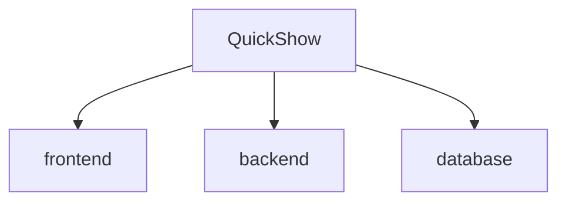

# 🎬 QuickShow

## 🗂️ Description

QuickShow is a full-stack online movie ticket booking platform built using React.js, React Router, Node.js, Express.js, MySQL and TiDB Cloud. It enables users to browse movies, check show timings, view seat availability, and book tickets seamlessly. The application provides a smooth and responsive user experience while offering administrators complete control over movie listings, show schedules, seat management, and booking records.

This project is ideal for developers looking to understand full-stack web development, REST API integration, authentication, database management, and real-world booking system workflows.

---

## ✨ Key Features

### 🎥 Movie Management
- Browse Now Showing and Upcoming Movies
- View detailed movie information
- Search and explore available movies
- Display movie posters, descriptions, genres, and timings

### 🎟️ Ticket Booking
- Select theatre and show timings
- Interactive seat selection
- Real-time seat availability tracking
- Instant booking confirmation
- Booking history for registered users

### 👤 User Authentication
- User Signup and Login
- Secure authentication system
- Personalized booking management
- Session-based user access

### 🛠️ Admin Dashboard
- Add new movies
- Edit existing movie details
- Delete movies from listings
- Manage theatre shows and schedules
- Manage seat layouts and availability
- View all user bookings

### 🌐 User Interface
- Responsive and modern UI
- Smooth navigation with React Router
- Material UI components
- User-friendly booking workflow

### 🔗 REST API Integration
- Frontend and backend communicate through REST APIs
- Efficient data handling using Axios
- Structured backend architecture

---

## 🗂️ Folder Structure



---

## 🛠️ Tech Stack


---

## ⚙️ Setup Instructions

### 1️⃣ Clone the Repository

```bash
git clone https://github.com/anushkaadak2684/QuickShow.git

cd QuickShow
```

### 2️⃣ Install Frontend Dependencies

```bash
cd frontend
npm install
```

### 3️⃣ Install Backend Dependencies

```bash
cd ../backend
npm install
```

### 4️⃣ Configure Environment Variables

Create a `.env` file inside the backend folder:

```env
DB_HOST=localhost
DB_USER=your_username
DB_PASSWORD=your_password
DB_NAME=quickshow
PORT=4000
```

### 5️⃣ Start Backend Server

```bash
npm start
```

or

```bash
nodemon server.js
```

### 6️⃣ Start Frontend Application

Open a new terminal:

```bash
cd frontend
npm start
```

### 7️⃣ Access the Application

Open your browser and navigate to:

```text
Frontend: http://localhost:3000
Backend : http://localhost:4000
```

---

## 📸 Application Modules

### 👤 User Module
- Browse Movies
- View Movie Details
- Select Show Timings
- Choose Seats
- Book Tickets
- View Booking History

### 🛠️ Admin Module
- Movie Management
- Show Management
- Seat Management
- Booking Monitoring
- Dashboard Controls

---

## 🔄 System Workflow

1. User logs in or creates an account.
2. Browse available movies.
3. Select a theatre and showtime.
4. Choose available seats.
5. Confirm booking.
6. Booking details are stored in the MySQL database.
7. User can view booking history.
8. Admin manages movies, schedules, and bookings.

---

## 🚀 Future Enhancements

- Online Payment Gateway Integration
- Email Ticket Confirmation
- QR Code-Based Ticket Validation
- AI-Based Movie Recommendations
- Real-Time Notifications
- Multi-Theatre Support
- Dark Mode Interface

---

## 🤝 Contributing

Contributions are welcome!

1. Fork the repository
2. Create a feature branch

```bash
git checkout -b feature-name
```

3. Commit your changes

```bash
git commit -m "Add new feature"
```

4. Push to your branch

```bash
git push origin feature-name
```

5. Open a Pull Request

---

## 👩‍💻 Author

**Anushka Adak**

B.Tech (CSBS) Student | Full Stack Developer

GitHub: https://github.com/anushkaadak2684

---

⭐ This is an academic DBMS project. If you found this project useful, consider giving it a star on GitHub!
